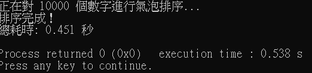
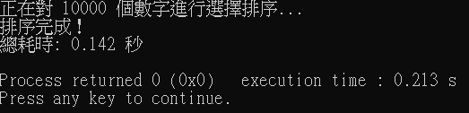
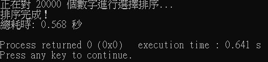
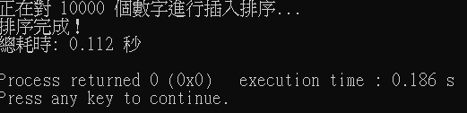
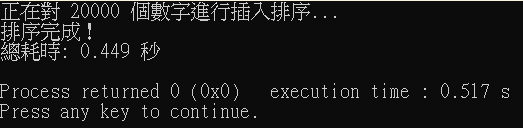
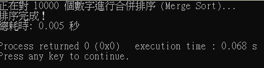
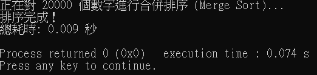
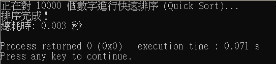
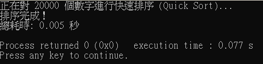

# 排序報告

**學號:** 11428106  
**姓名:** 李曉涵  
**模擬頁面:** https://1lxiaohan.github.io/sort_report/

---

## 氣泡排序法 (Bubble Sort)

* **原理簡述：** 簡單來說，這就是一種「兩兩互相比大小」的方法。程式會從頭開始看，每次抓相鄰的兩個數字來比，如果前面的比後面大就交換位置。這樣跑完一輪後，最大的那個數就會像氣泡一樣被「推」到最後面。重複這個動作，直到所有數字都排好、完全不用再交換為止。
* **複雜度分析：**
  * 最佳時間複雜度： $O(n)$ 
  * 平均時間複雜度： $O(n^2)$ 
  * 最壞時間複雜度： $O(n^2)$ 
  * 空間複雜度： $O(1)$ 
  * 結論：氣泡排序（Bubble Sort）最大的優點就是「原地排序」，空間複雜度只有 $O(1)$，不需要額外開記憶體。
如果資料本來就是排好的，跑一次 $O(n)$ 就能結束；但平均來說，它的時間複雜度還是 $O(n^2)$。因為它要一直重複比對、交換隔壁的數字，所以當遇到大量資料時會很慢。實務上很少拿它來處理大數據。
* **模擬實作內容：**

 

 
 

---

## 選擇排序法 (Selection Sort)

* **原理簡述：** 核心想法是把陣列分成「排好的」跟「還沒排的」兩邊。每一輪程式都會去剩下的「未排序區間」裡掃描一遍，把最小的那個數字找出來，直接跟未排序區間的第一個數字交換位置。這樣一來，最小的數就被歸類到「已排序」那邊了。
* **複雜度分析：**
  * 最佳時間複雜度： $O(n^2)$ 
  * 平均時間複雜度： $O(n^2)$ 
  * 最壞時間複雜度： $O(n^2)$ 
  * 空間複雜度： $O(1)$ 
  * 結論：選擇排序跟氣泡排序一樣，空間複雜度很低，只需要 $O(1)$ 的額外空間。它最大的缺點為不管原本的數字排得多整齊，它每一輪都一定要把剩下的數字全部掃描一遍，才能確定誰最小。
所以不管是最好、最壞還是平均情況，它的時間複雜度通通都是 $O(n^2)$，效能表現非常固定。
* **模擬實作內容：**

  
  

---

## 插入排序法 (Insertion Sort)

* **原理簡述：** 運作方式類似於玩家在手中整理撲克牌。將陣列分為「已排序」與「未排序」區間，每次從未排序區間抽取出第一個元素，並在已排序區間中由後往前逐一比對，尋找合適的空位並將其「插入」。
* **複雜度分析：**
  * 最佳時間複雜度： $O(n)$ 
  * 平均時間複雜度： $O(n^2)$ 
  * 最壞時間複雜度： $O(n^2)$ 
  * 空間複雜度： $O(1)$ 
  * 結論：插入排序同樣只需要 $O(1)$ 的額外空間，非常節省記憶體。它的優點是「遇到排得差不多」的資料時，速度會快很多，時間複雜度甚至可以接近 $O(n)$。但在資料很亂的時候，平均和最壞情況還是 $O(n^2)$。
* **模擬實作內容：**

  
  

---

## 合併排序法 (Merge Sort)

* **原理簡述：** 簡單來說，就是先把一整串亂七八糟的數字從中間切開，一直切、一直切，直到每個數字都變成獨立的一個小組。接著，我們再把這些小組兩兩「合併」回來。合併的時候會一邊比大小、一邊排好順序放進暫存區，把所有小片段變回一個排好序的完整陣列。 
* **複雜度分析：**
  * 最佳時間複雜度： $O(n log n)$ 
  * 平均時間複雜度： $O(n log n)$ 
  * 最壞時間複雜度： $O(n log n)$ 
  * 空間複雜度： $O(n)$ 
  * 結論：合併排序是典型的「空間換時間」。雖然它需要額外準備一個跟原本一樣大（$O(n)$）的暫存空間，但它的效能極其穩定。不管資料原本長怎樣，它的時間複雜度永遠穩定在 $O(n \log n)$。
* **模擬實作內容：**
  
  

---

## 快速排序法 (Quick Sort)

* **原理簡述：** 它的核心動作是先選一個數字當作基準點 (Pivot)。接著把剩下的數字拿來跟它比：比它小的通通丟到左邊，比它大的通通丟到右邊。當這一輪分完後，那個基準點就排好了。接著，只要對左右兩邊沒排好的部分重複這個動作，最後整串數字就會迅速排好。
* **複雜度分析：**
  * 最佳時間複雜度： $O(n log n)$ 
  * 平均時間複雜度： $O(n log n)$ 
  * 最壞時間複雜度： $O(n^2)$ 
  * 空間複雜度： $O(log n)$ 
  * 結論：快速排序在處理一般隨機資料時，平均時間複雜度穩定在 $O(n \log n)$。雖然在最倒霉的情況（比如選錯基準值）下會退化到 $O(n^2)$。雖然遞迴會稍微佔一點空間，但只要選基準點的策略做個優化，它會是目前大多數程式語言內建排序功能的首選。
* **模擬實作內容：**

 
 

---

## 綜合比較

| 排序演算法 | 最佳時間複雜度 | 平均時間複雜度 | 最壞時間複雜度 | 空間複雜度 | 穩定性 |
| :--- | :--- | :--- | :--- | :--- | :--- |
| **氣泡排序** | $O(n)$  | $O(n^2)$ | $O(n^2)$ | $O(1)$ | 穩定 |
| **選擇排序** | $O(n^2)$ | $O(n^2)$ | $O(n^2)$ | $O(1)$ | 不穩定 |
| **插入排序** | $O(n)$ | $O(n^2)$| $O(n^2)$ | $O(1)$ | 穩定 |
| **合併排序** | $O(n log n)$ | $O(n log n)$ | $O(n log n)$ | $O(n)$| 穩定 |
| **快速排序** | $O(n log n)$ | $O(n log n)$ | $O(n^2)$ | $O(log n)$ | 不穩定 |

| 排序演算法 | 資料量(n) | 執行耗時(秒) | 時間複雜度 |
| :--- | :--- | :--- | :--- | 
| **氣泡排序** | 10000| 0.451 | $O(n^2)$|
|   | 20000| 1.854 | $O(n^2)$ | 
| **選擇排序** | 10000 | 0.142 |$O(n^2)$ | 
|  | 20000 | 0.568 | $O(n^2)$ | 
| **插入排序** | 10000 | 0.112 |$O(n^2)$| 
|  | 20000 | 0.449 | $O(n^2)$ | 
| **合併排序** | 10000 | 0.005 |$O(n log n)$ |
|  | 20000 | 0.009 | $O(n log n)$ |
| **快速排序** | 10000 | 0.003 | $O(n log n)$ | 
|  | 20000 | 0.005 | $O(n log n)$ | 

**數據分析：**
1. 平方增長的規律：在氣泡、選擇、插入這三種 $O(n^2)$ 的演算法中，當資料量 $n$ 增加 2 倍時，執行時間都精確地增加了約 4 倍 ($2^2$)。完美驗證了二次方時間複雜度的理論模型。
2. 效能差距：當資料量來到 20,000 筆時，最慢的氣泡排序 (1.854s) 與最快的快速排序 (0.005s) 已經差了將近 370 倍。
3. 常數項的差異：雖然氣泡、選擇、插入都是 $O(n^2)$，但插入排序明顯比氣泡排序快很多。

---

## 學習心得
1. **專案感想：** 剛開始接觸各種排序法時，不太能理解時間複雜度，他對我而言只是數學符號。但透過在 Code::Blocks 上的實作，我了解了不同演算法在效能上有如此大的區別。資料量只有一萬時，氣泡排序與快速排序的差距就已經接近百倍；如果是處理大數據（如百萬、千萬筆），選錯演算法就不是等幾秒鐘的問題，而是程式會直接卡死。
2. **困難與解決**
   1. 一開始誤將檔案存成.C，導致教學動畫跑不出來，後來將檔名改成.html才順利跑出東西
   2. 本來將資料設為10萬筆，在跑 $O(n^2)$ 演算法（如氣泡排序）視窗會卡住幾秒鐘。一開始以為是程式當掉，後來才發現是因為數據太大，需要時間跑，於是最後將數據設為1萬，減輕電腦負擔。
3. **對演算法效率的體會：** 氣泡、選擇與插入排序雖然好理解、好實作，但隨著資料量翻倍，耗時會以「平方倍」劇增。這在實驗中得到了驗證（從 0.4s 變為 1.8s）。而進階一點的排序法表現非常優秀。即便資料量加倍，它們增加的時間幾乎微乎其微。這讓我明白一個道理"選對演算法比提升硬體效能更有成本效益"。

